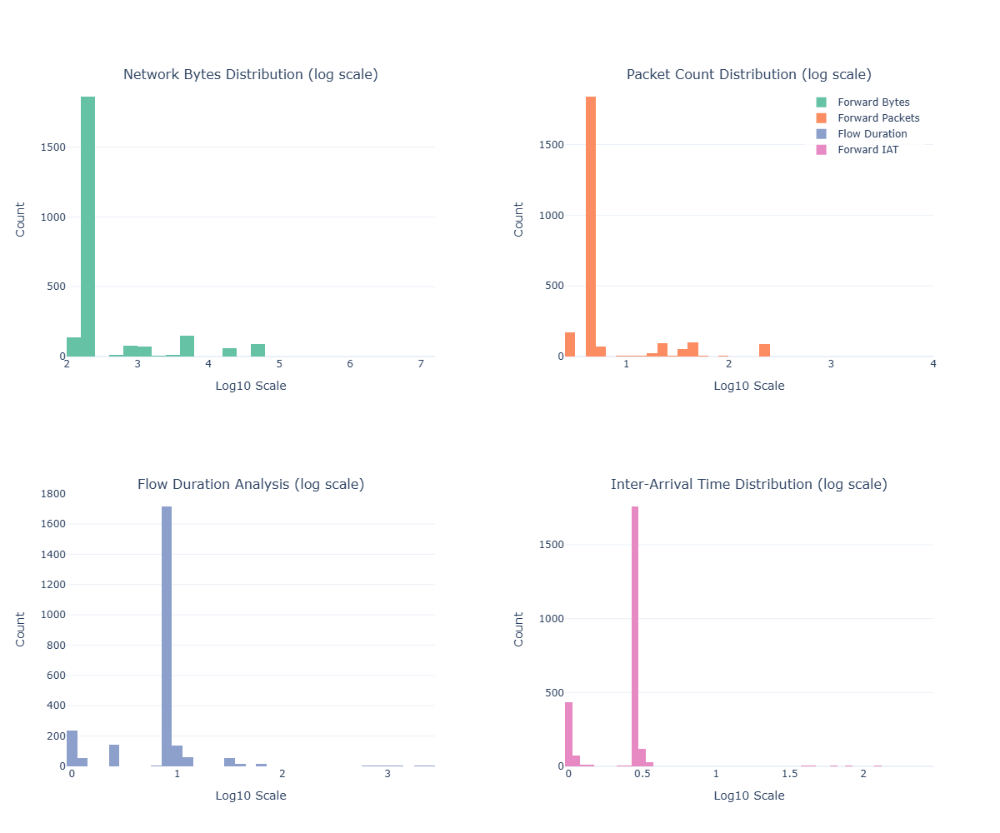
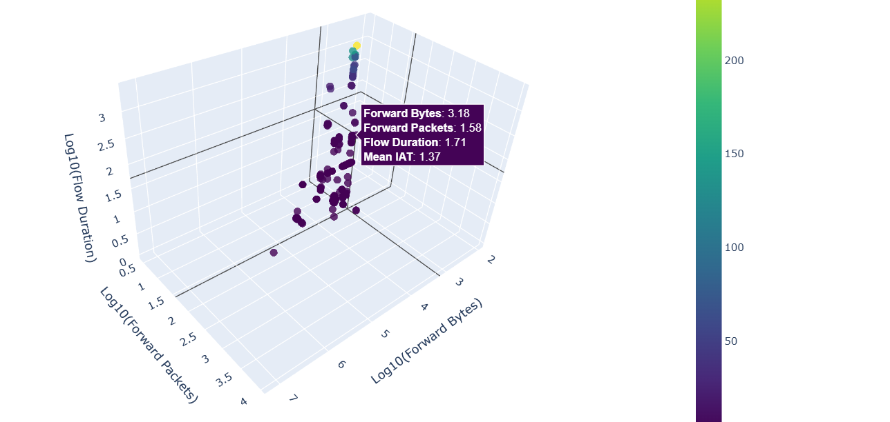
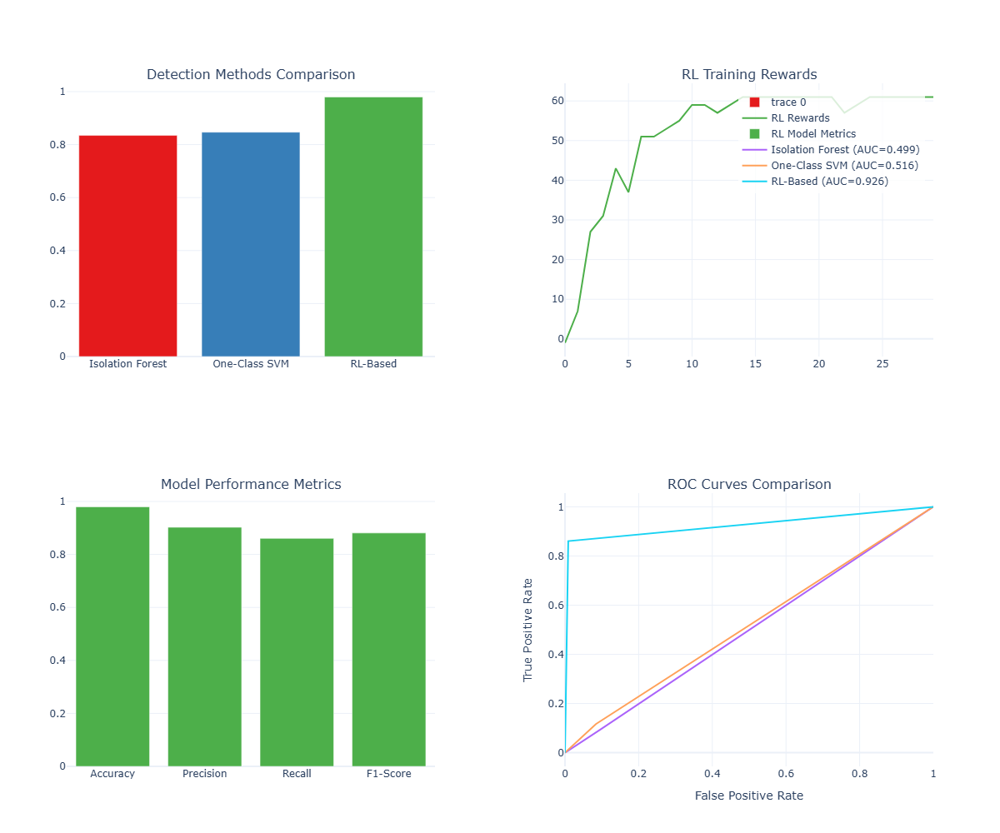

---

# 🚀 Zero-Day Attack Detection using Reinforcement Learning  
[](https://www.python.org/)  
[](https://pytorch.org/)  
[](#)  

🔐 **Zero-Day Attack Detection** is a **Reinforcement Learning-based Intrusion Detection System (IDS)** that effectively identifies **previously unseen cyber threats**. It integrates:  

✔ **Isolation Forest** & **One-Class SVM** for anomaly detection  
✔ **Deep Q-Network (DQN)** for adaptive learning  
✔ **CICIDS2017 dataset** for real-world attack simulations  

---

## 📜 Table of Contents  

- [✨ Features](#-features)  
- [⚙️ Installation](#️-installation)  
- [🚀 Usage](#-usage)  
- [🧠 Model Architecture](#-model-architecture)  
- [📊 Results](#-results)  
- [📂 Dataset](#-dataset)  
- [🤝 Contribution](#-contribution)  

---

## ✨ Features  

✔ **Zero-Day Threat Detection** – Identifies new & evolving attacks in real time  
✔ **Reinforcement Learning (DQN)** – Adapts dynamically to changing attack patterns  
✔ **Hybrid Anomaly Detection** – Combines Isolation Forest & One-Class SVM  
✔ **Real-World Dataset** – Trained on **CICIDS2017**, a benchmark dataset  
✔ **Scalable & Secure** – Designed for enterprise-level cybersecurity  

---

## ⚙️ Installation  

Make sure you have **Python 3.8+** installed. Follow these steps to set up the project:  

```bash
# Clone the repository
git clone https://github.com/your-repo/Zero-Day-Attack-Using-RL.git
cd zero-day-attack-detection

# Install dependencies
pip install numpy pandas scikit-learn matplotlib seaborn tensorflow torch kaggle
```

---

## 🚀 Usage  

Run the script to **train and evaluate the model**:  

```bash
python zero_day_attack_detection.py
```

### 📌 Example Workflow:  

1️⃣ **Preprocess Data** – Cleans and prepares the CICIDS2017 dataset  
2️⃣ **Feature Engineering** – Extracts meaningful security features  
3️⃣ **Train Isolation Forest & One-Class SVM** – Initial anomaly detection models  
4️⃣ **Train Deep Q-Network (DQN)** – Reinforcement Learning improves accuracy  
5️⃣ **Evaluate and Visualize Results** – Generate performance reports  

---

## 🧠 Model Architecture  

The model consists of three key components:  

🔹 **Isolation Forest** – Detects anomalies in network traffic  
🔹 **One-Class SVM** – Classifies normal vs. abnormal network behavior  
🔹 **Deep Q-Network (DQN)** – Reinforcement Learning for adaptive security  

```
                 ┌──────────────────┐
                 │  Network Traffic │
                 └────────┬─────────┘
                          ▼
      ┌───────────────────────────────────┐
      │ Feature Engineering & Preprocessing│
      └───────────────────────────────────┘
                          ▼
      ┌───────────────┬───────────────┬───────────────┐
      │ Isolation     │ One-Class SVM │ Deep Q-Network│
      │ Forest       │ (Anomaly Classifier) │ (RL Model) │
      └───────────────┴───────────────┴───────────────┘
                          ▼
      ┌───────────────────────────────────┐
      │       Threat Classification       │
      └───────────────────────────────────┘
```

---

## 📊 Results  

📌 **Detection Accuracy:** *XX.XX%*  
📌 **False Positive Rate:** *X.XX%*  
📌 **Performance Gain over Baseline:** *X.XX%*  

### 🔍 Distribution Analysis 
  

### 🔍 3D Model   
  

### 🔍 Anomaly Detection Visualization  
  

📌 **Replace the above placeholders with actual results and images after running the model.**  

---

## 📂 Dataset  

The model is trained on the **CICIDS2017 dataset**, which includes **benign traffic and various cyberattacks**.  

🔗 [Download Dataset](https://www.unb.ca/cic/datasets/ids-2017.html)  

---

## 🤝 Contribution  

🔹 **Fork the repository**  
🔹 **Create a new branch (`git checkout -b feature-branch`)**  
🔹 **Commit your changes (`git commit -m "Added a new feature"`)**  
🔹 **Push to the branch (`git push origin feature-branch`)**  
🔹 **Open a Pull Request**  

Contributions are always welcome! 🚀  


---

🔥 **If you find this project useful, give it a ⭐ on GitHub!** 🔥  

---


